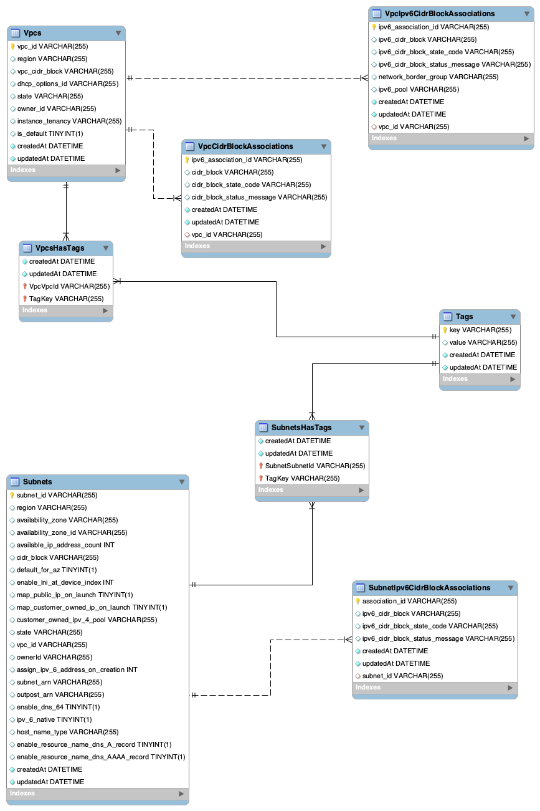

# 2022 당근마켓 WINTERTECH 인턴십
 SRE 직군 과제 전형 프로젝트 2번
## 목차
- [Goals](#Goals)
- [How It Works](#How-It-Works)
- [API 명세](#API-명세)
- [Getting Started](#Getting-Started)
- [API 호출 예시](#API-호출-예시)
## Goals
- AWS API를 이용하여 AWS 계정 내 특정 리전의 VPC 정보와 Subnet 정보를 가져와서 RDBMS에 저장하는 API 구현
## How It Works
### 1. AWS API 선택
[AWS SDK for JavaScript V3](https://docs.aws.amazon.com/AWSJavaScriptSDK/v3/latest/index.html)의 [EC2-Client SDK](https://docs.aws.amazon.com/AWSJavaScriptSDK/v3/latest/clients/client-ec2/index.html)를 선택하였습니다.
VPC의 정보를 가져오기 위해 [DescribeVpcsCommand](https://docs.aws.amazon.com/AWSJavaScriptSDK/v3/latest/clients/client-ec2/classes/describevpcscommand.html)를 사용하였고, Subnet의 정보를 가져오는 데에는 [DescribeSubnetsCommand](https://docs.aws.amazon.com/AWSJavaScriptSDK/v3/latest/clients/client-ec2/classes/describesubnetscommand.html)를 사용하였습니다.

### 2. DB Table 설계
위 AWS API의 응답 명세 ([VPC (interface)](https://docs.aws.amazon.com/AWSJavaScriptSDK/v3/latest/clients/client-ec2/interfaces/vpc.html), [Subnet (interface)](https://docs.aws.amazon.com/AWSJavaScriptSDK/v3/latest/clients/client-ec2/interfaces/subnet.html))를 참고하여 아래와 같이 테이블을 설계 하였습니다.

### Tables
- Vpcs: VPC의 기본 정보를 담는 테이블
- VpcCidrBlockAssociations: VPC의 VpcCidrBlockAssociation 배열을 담는 테이블
- VpcIpv6CidrBlockAssociations: VPC의 VpcIpv6CidrBlockAssociation 배열을 담는 테이블
- VpcsHasTags: VPC와 Tag의 연관 테이블
- Tags: Tag 정보를 담는 테이블
- Subnets: Subnet의 기본 정보를 담는 테이블
- SubnetIpv6CidrBlockAssociations: Subnet의 SubnetIpv6CidrBlockAssociation 배열을 담는 테이블
- SubnetsHasTags: Subnet과 Tag의 연관 테이블
### 연관 설정
- Vpcs - VpcCidrBlockAssociations (1 to n)
- Vpcs - VpcIpv6CidrBlockAssociations (1 to n)
- Vpcs - Tags (m to n)
- Subnets - SubnetIpv6CidrBlockAssociations (1 to n)
- Subnets - Tags (m to n)
### 3. API 요청
src/types/dto/saveVpcSubnetRequest.ts
```typescript
export interface SaveVpcSubnetRequest {
    accessKeyId: string
    secretAccessKey: string
    region: string
}
```
AWS 계정 정보(accessKeyId, SecretAccessKey)와 리전 정보를 request body로 받게 하였습니다.
### 4. 서비스 로직
#### 4-1. EC2-Client 생성
src/service/ec2Service.ts
```typescript
// EC2Client 생성
const createEC2Client = (request: SaveVpcSubnetRequest) => {
    return new EC2Client(createEC2config(request));
}

// EC2Client 설정 생성
const createEC2config = (request :SaveVpcSubnetRequest) => {
    return {
        region: request.region,
        credentials: {
            accessKeyId: request.accessKeyId,
            secretAccessKey: request.secretAccessKey
        }
    }
}

export { createEC2Client };
```
request body를 통해 받은 AWS 계정 정보가 담긴 credentials와 리전 정보를 담아 EC2-Client를 생성하는 함수를 작성하였습니다.
#### 4-2 VPC 정보 조회 및 DB 저장
```typescript
// Subnet 정보 저장
export default async (request: Request) => {
    const requestBody: SaveVpcSubnetRequest = request.body;

    const client = createEC2Client(requestBody);

    let command, input;
    let data: DescribeVpcsCommandOutput;
    let vpcs: Vpc[] | undefined;
    let nextToken: string | undefined = undefined;
    
    do {
        input = (nextToken == undefined) ? {} : {NextToken: nextToken};
        command = new DescribeVpcsCommand({});
        data = await client.send(command);

        vpcs = data.Vpcs;
        nextToken = data.NextToken;

        if (vpcs != undefined) {
            vpcs.forEach((vpc) => {
                insertVpc(vpc, requestBody.region);
            });
        }
    } while (nextToken != undefined)

    const msg: SaveVpcSubnetResponse = {
        status: 200,
        statusMessage: "VpcsInfoSavedSuccess"
    }

    return msg;
}

// VPC와 자식 관계 데이터 Insert
const insertVpc = async (vpc: Vpc, region: string) => {
    const includeStatement: ModelStatic<any>[] = [];
    if(vpc.Ipv6CidrBlockAssociationSet != undefined && vpc.Ipv6CidrBlockAssociationSet.length != 0){
        includeStatement.push(db.VpcIpv6CidrBlock);
    }
    if(vpc.CidrBlockAssociationSet != undefined && vpc.CidrBlockAssociationSet.length != 0) includeStatement.push(db.VpcCidrBlock);
    if(vpc.Tags != undefined && vpc.Tags.length != 0) includeStatement.push(db.Tags);

    await db.Vpc.create(vpcToEntity(vpc, region), {include: includeStatement})
        .catch((error) => {
            db.Vpc.destroy({where: {vpcId: error.fields.PRIMARY}}).then(() => {
                db.Vpc.create(vpcToEntity(vpc, region), {include: includeStatement});
            });
        }
    );
}

// Response body entity 형태로 변환
const vpcToEntity = (vpc: Vpc, region: string) => {...}
const vpcIpv6CidrBlockToEntity = (vpcIpv6CidrBlockSet: VpcIpv6CidrBlockAssociation[] | undefined) => {...}
const vpcCidrBlockToEntity = (vpcCidrBlockSet: VpcCidrBlockAssociation[] | undefined) => {...}
const tagsToEntity = (tags: Tag[] | undefined) => {...}
```
1. 위에서 작성한 EC2-Client 생성 함수를 통해 EC2-Client 생성
2. 모든 VPC정보를 조회 할 수 있도록 input 설정을 통한 필터링은 하지 않음
3. AWS API를 통해 받은 response를 DB에 저장할 수 있도록 entity(table) 형태로 변환
4. 변환 한 데이터를 DB에 저장, 만약 이미 저장된 VPC라면 기존 데이터 삭제 후 저장 (연관 관계 테이블의 데이터들까지 새로 받아온 정보로 대체하기 위해 업데이트 대신 삭제 후 insert하는 방식을 택했습니다. )
5. 저장에 성공했다는 Response 반환
#### 4-3 Subnet 정보 조회 및 저장
```typescript
// Subnet 정보 저장
export default async (request: Request) => {
    const requestBody: SaveVpcSubnetRequest = request.body;

    const client = createEC2Client(requestBody);

    let command, input;
    let data: DescribeSubnetsCommandOutput;
    let subnets: Subnet[] | undefined;
    let nextToken: string | undefined = undefined;
    
    do {
        input = (nextToken == undefined) ? {} : {NextToken: nextToken};
        command = new DescribeSubnetsCommand(input);
        data = await client.send(command);

        subnets = data.Subnets;
        nextToken = data.NextToken;

        if (subnets != undefined) {
            subnets.forEach((subnet) => {
                insertSubnet(subnet, requestBody.region);
            });
        }
    } while (nextToken != undefined)

    const msg: SaveVpcSubnetResponse = {
        status: 200,
        statusMessage: "SubnetsInfoSavedSuccess"
    }

    return msg;
}

// subnet과 자식 관계 데이터 Insert
const insertSubnet = async (subnet: Subnet, region: string) => {
    const includeStatement: ModelStatic<any>[] = [];
    if(subnet.Ipv6CidrBlockAssociationSet != undefined && subnet.Ipv6CidrBlockAssociationSet.length != 0) {
        includeStatement.push(db.SubnetIpv6CidrBlock);
    }
    if(subnet.Tags != undefined && subnet.Tags.length != 0) includeStatement.push(db.Tags);

    await db.Subnet.create(subnetToEntity(subnet, region), {include: includeStatement})
        .catch((error) => {
                db.Subnet.destroy({where: {subnetId: error.fields.PRIMARY}}).then(() => {
                    db.Subnet.create(subnetToEntity(subnet, region), {include: includeStatement});
                });
            }
        );
}

const subnetToEntity = (subnet: Subnet, region: string) => {...}
const subnetIpv6CidrBlockAssociationToEntity = (subnetIpv6CidrBlockSet: SubnetIpv6CidrBlockAssociation[] | undefined) => {...}
const tagsToEntity = (tags: Tag[] | undefined) => {...}
}
```
1. 위에서 작성한 EC2-Client 생성 함수를 통해 EC2-Client 생성
2. 모든 Subnet 정보를 조회 할 수 있도록 input 설정을 통한 필터링은 하지 않음
3. AWS API를 통해 받은 response를 DB에 저장할 수 있도록 entity(table) 형태로 변환
4. 변환 한 데이터를 DB에 저장, 만약 이미 저장된 VPC라면 기존 데이터 삭제 후 저장 (연관 관계 테이블의 데이터들까지 새로 받아온 정보로 대체하기 위해 업데이트 대신 삭제 후 insert하는 방식을 택했습니다. )
5. 저장에 성공했다는 Response 반환
## API 명세
### POST: /save_vpcs
AWS 특정 계정과 리전의 모든 VPC 정보를 조회하여 DB에 저장한다.
#### Request Body (Data Params)
| Name            | Type   | Description           |
|-----------------|--------|-----------------------|
| accessKeyId     | string | AWS access_key_id     |
| secretAccessKey | string | AWS secret_access_key |
| region          | string | AWS 리전                |
```json
{
  "accessKeyId": string,
  "secretAccessKey": string,
  "region": string
}
```
#### Response Body
| Name          | Type   | Description |
|---------------|--------|-------------|
| status        | number | 응답 상태 코드    |
| statusMessage | string | 응답 상태 메세지   |
#### Success Response
- status: 200
- statusMessage: VpcsInfoSavedSuccess
#### 40x Response
accessKeyId 또는 secretAccessKey가 유효하지 않을 때
- status: 401
- statusMessage: AuthFailure
### POST: /save_subnets
AWS 특정 계정과 리전의 모든 Subnet 정보를 조회하여 DB에 저장한다.
#### Request Body (Data Params)
| Name            | Type   | Description           |
|-----------------|--------|-----------------------|
| accessKeyId     | string | AWS access_key_id     |
| secretAccessKey | string | AWS secret_access_key |
| region          | string | AWS 리전                |
```json
{
  "accessKeyId": string,
  "secretAccessKey": string,
  "region": string
}
```
#### Response Body
| Name          | Type   | Description |
|---------------|--------|-------------|
| status        | number | 응답 상태 코드    |
| statusMessage | string | 응답 상태 메세지   |
#### Success Response
- status: 200
- statusMessage: SubnetsInfoSavedSuccess
#### 40x Response
accessKeyId 또는 secretAccessKey가 유효하지 않을 때
- status: 401
- statusMessage: AuthFailure
## Getting Started
### Requirements
- Node 18.12.x LTS
- MySQL 8.0.x<p>
또는
- Docker Compose
### Run Server with Docker Compose
Node 컨테이너와 MySQL 컨테이너로 Docker Compose를 구성하였습니다.
API 서버의 포트를 3000번 포트로 포트포워딩 하였습니다.
```shell
$docker-compose up -d
```
## API 호출 예시
### VPC 저장
Request
```shell
curl -X POST -H "Content-Type: application/json" \
-d "{\"accessKeyId\":\"$AWS_ACCESS_KEY_ID\",\
\"secretAccessKey\":\"$AWS_SECRET_ACCESS_KEY\", \
\"region\":\"ap-northeast-2\"}" \
http://127.0.0.1:3000/save_vpcs
```
Response
```shell
{"status":200,"statusMessage":"VpcsInfoSavedSuccess"}% 
```
### Subnet 저장
Request
```shell
curl -X POST -H "Content-Type: application/json" \
-d "{\"accessKeyId\":\"$AWS_ACCESS_KEY_ID\",\
\"secretAccessKey\":\"$AWS_SECRET_ACCESS_KEY\", \
\"region\":\"ap-northeast-2\"}" \
http://127.0.0.1:3000/save_subnets
```
Response
```shell
{"status":200,"statusMessage":"SubnetsInfoSavedSuccess"}% 
```